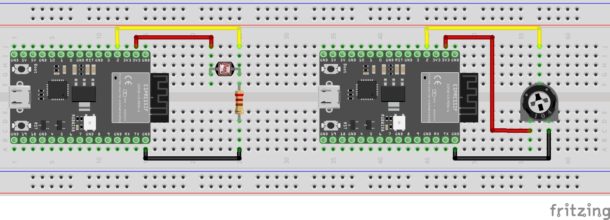

# Analog I/O: Photoresistor and trimpot

Note: the same code works for both the photoresistor and the potentiometer.
Analog I/O is pretty chill like that (and very difficult in other ways.

As configured, more light means higher values printed to Serial, less light: smaller values (which makes sense with how voltage dividers work).
If you switch the resistor and the photocell, the behavior will be reversed!

## Schematic


## Hookup Diagram


## Sample Code
```cpp
#define ADCPIN 2
// remember to check your dev board's pinout for
// which pins are ADC compatible

void setup() {
  // put your setup code here, to run once:
  // No need to set the pin mode since we're doing analog logic, but we will use
  // The serial port to print the values
  Serial.begin(115200);
  while (!Serial) delay(1);
}

void loop() {
  // put your main code here, to run repeatedly:
  Serial.print("analogRead: ");
  Serial.println(analogRead(ADCPIN));
  delay(500);
}
```
