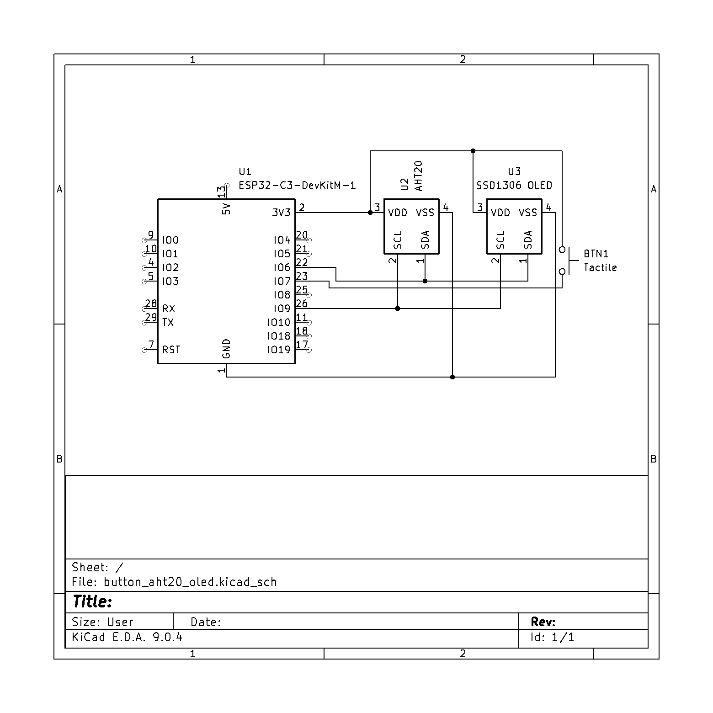
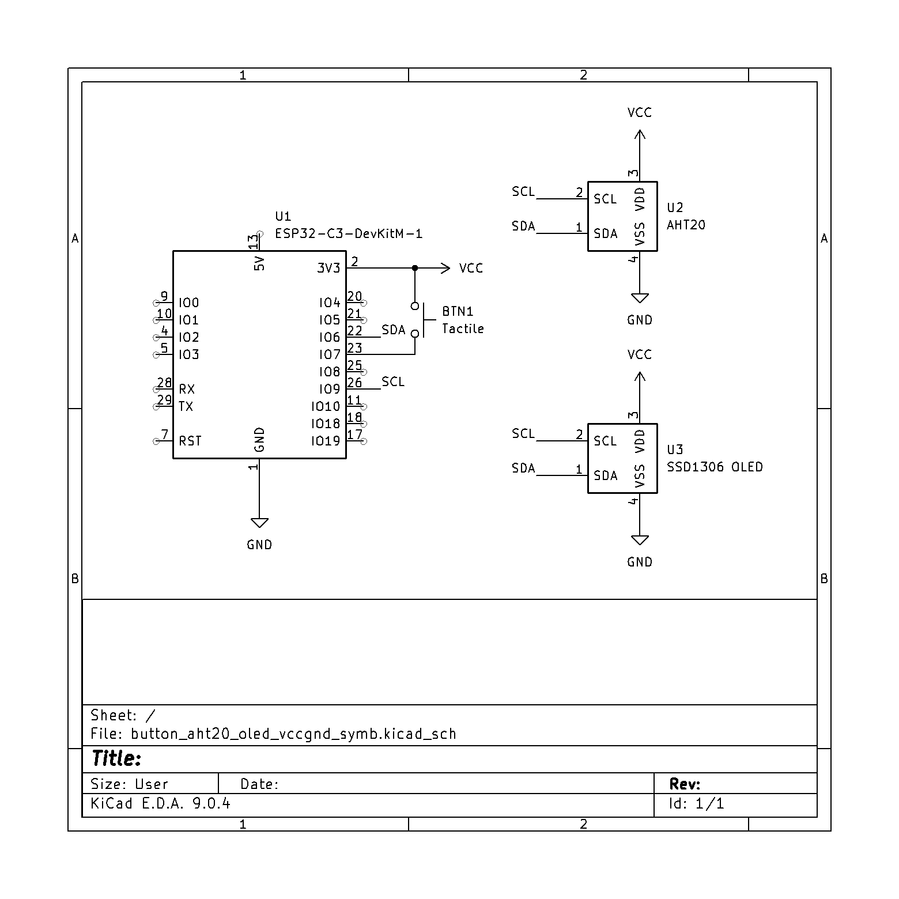
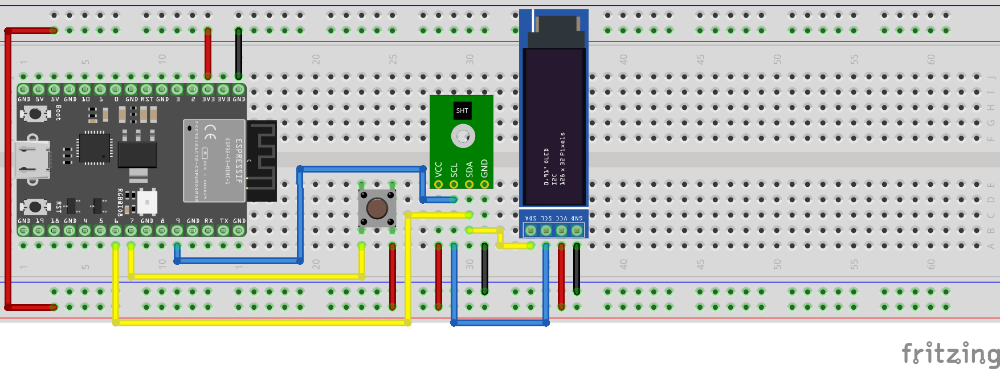

# Button Polling and I2C: AHT20, OLED

## Schematic


This is an example of a schematic that works well with net names



## Hookup Diagram
Important Note: the OLED component and Temperature/Humidity sensor are not identical to those in your kit, but the hookup is the same.
ALWAYS check your pinouts of your components



## Sample Code
```cpp
// Install the Adafruit AHTX0 library
#include <Adafruit_AHTX0.h>
#include <Adafruit_SSD1306.h>
#include <Wire.h>
//#include <FastLED.h>

#define BTN_PIN 7

//CRGB led[1];

// I2C redefinitions
#define SDA_PIN 6
#define SCL_PIN 9
#define LED_PIN 8

TwoWire i2c(0);
Adafruit_AHTX0 aht20;
Adafruit_SSD1306 oled (128, 64, &i2c);
sensors_event_t temp, humid;

void setup() {
  // put your setup code here, to run once:
  /*FastLED.addLeds<NEOPIXEL, LED_PIN>(led, 1);
  led[0] = CRGB::Black;
  FastLED.show();*/
  pinMode(BTN_PIN, INPUT_PULLDOWN);
  Serial.begin(115200);
  while(!Serial) delay(1);
  i2c.begin(SDA_PIN, SCL_PIN);
  if (!aht20.begin(&i2c))
  {
    Serial.println("Could not init sensor. halp");
    while(1);
  }
  if (!oled.begin(SSD1306_SWITCHCAPVCC, 0x3c))
  {
    Serial.println("Can't find screen");
    while(1);
  }
  oled.clearDisplay();
  oled.setTextSize(1);
  oled.setTextColor(SSD1306_WHITE);
  oled.setCursor(0,0);
  oled.println(F("Hello world!"));
  oled.display();

}

void loop() {
  // put your main code here, to run repeatedly:
  //Serial.println(digitalRead(BTN_PIN));
  if (digitalRead(BTN_PIN))
  {
    aht20.getEvent(&humid, &temp);
    Serial.print("Humidity: ");
    Serial.println(humid.relative_humidity);
    Serial.print("Temperature: ");
    Serial.println(temp.temperature);
    oled.clearDisplay();
    oled.setCursor(0,0);
    oled.print("Humidity: "); oled.print(humid.relative_humidity); oled.println("%");
    oled.print("Temperature: "); 
    oled.print(temp.temperature * 9 / 5 + 32); 
    oled.println("F");
    oled.display();
  }
  delay(500);
}
```
