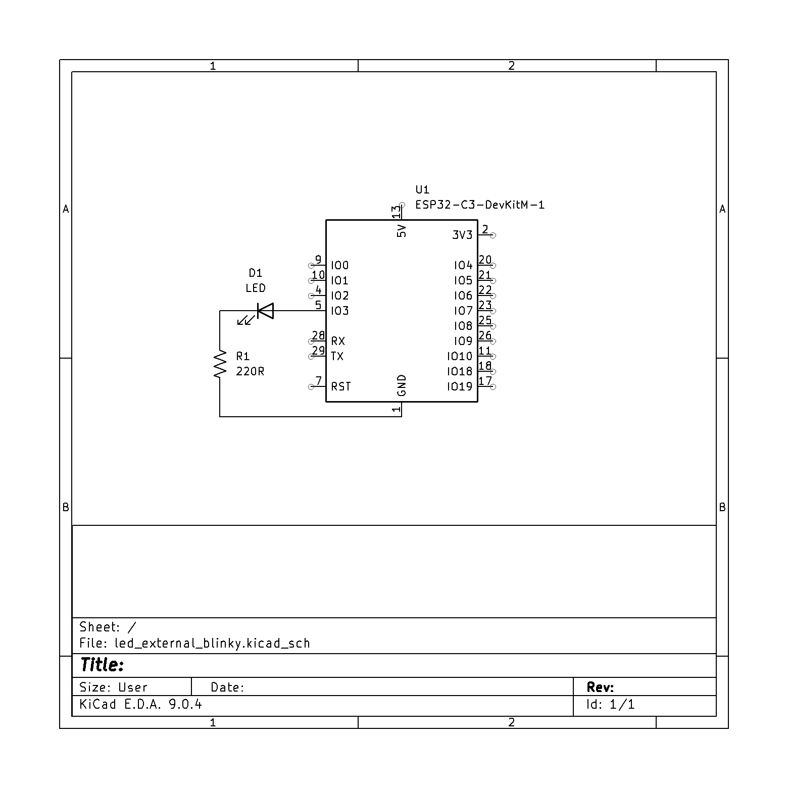
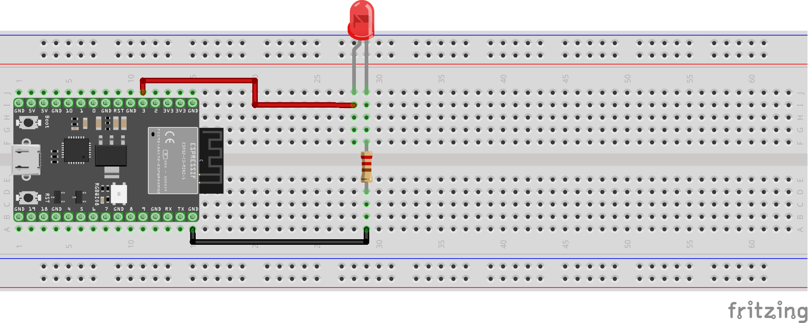

# Blinking External LEDs: Digital Output

## Schematic


## Hookup Diagram


## Sample Code
```cpp
// led_external_blinky.ino
#define LEDPIN 3

bool is_on = true;

void setup() {
  // put your setup code here, to run once:
  // We're doing digital logic, so we need to set the output mode
  pinMode(LEDPIN, OUTPUT);
  // Sets the pin to "high", on our boards this is 3.3V
  // Note: HIGH is a macro that just means 1, LOW is 0
  digitalWrite(LEDPIN, HIGH);
}

void loop() {
  // put your main code here, to run repeatedly:
  // Varying degrees of magic
  /*if (is_on)
  {
    is_on = false;
    digitalWrite(LEDPIN, LOW);
  }
  else
  {
    is_on = true;
    digitalWrite(LEDPIN, HIGH);
  }*/
  // magic 2: boolean values correspond to 1/0 for true/false
  is_on = !is_on; // toggle is_on
  digitalWrite(LEDPIN, is_on);
  // magic 3; can replace with just digitalWrite(LEDPIN, is_on = !is_on);
  // You can also do shenanigans with bitwise logic; as discused in class
  // it's a cool idea, but probably not a "good" idea.
  // wait a half second so we can see the blinky goodness
  delay(500);
}
```
