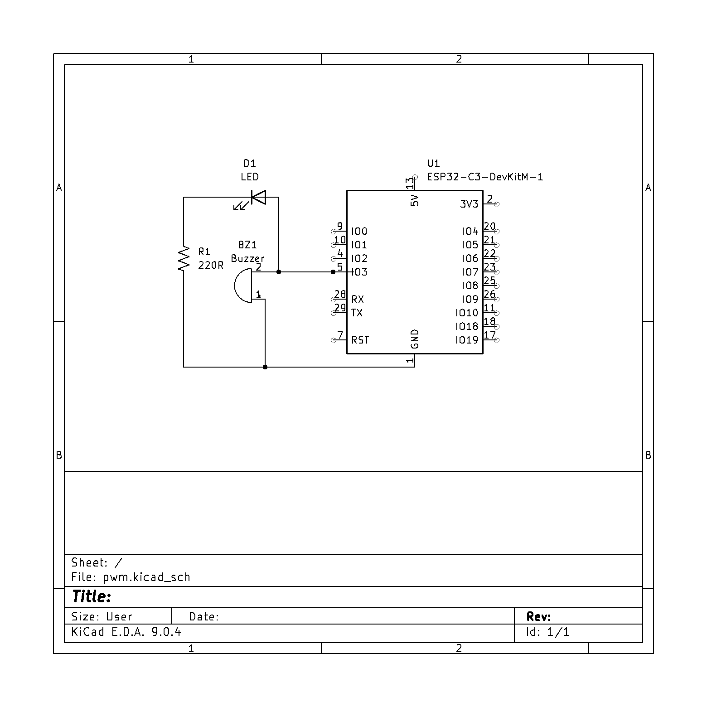
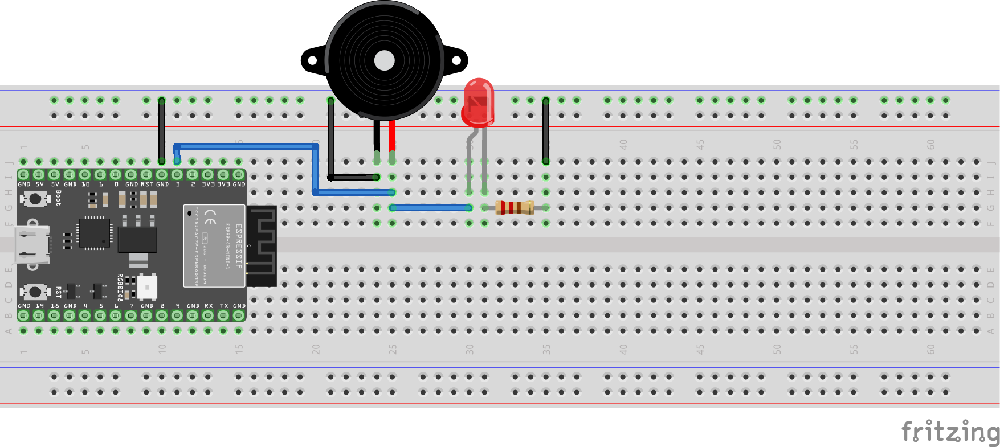

# Analog I/O: Photoresistor and trimpot

Note: We used the same circuit to see PWM with both the LED and Piezo Buzzer (we played with both PWM and frequency).  
Arduino has PWM/Analog output abilities built in; check out `analogWrite` and its associated helper functions to see how you can play with that.

## Schematic


## Hookup Diagram


## Sample Code
```cpp
#define OUTPUT_PIN 3
bool is_on = true;

void setup() {
  // put your setup code here, to run once:
  pinMode(OUTPUT_PIN, OUTPUT);
}

void loop() {
  // put your main code here, to run repeatedly:
  //is_on = !is_on;
  //digitalWrite(OUTPUT_PIN, is_on);
  digitalWrite(OUTPUT_PIN, HIGH);
  usleep(500);
  //delay(2);
  digitalWrite(OUTPUT_PIN, LOW);
  usleep(500);
  //delay(1);
}
```
