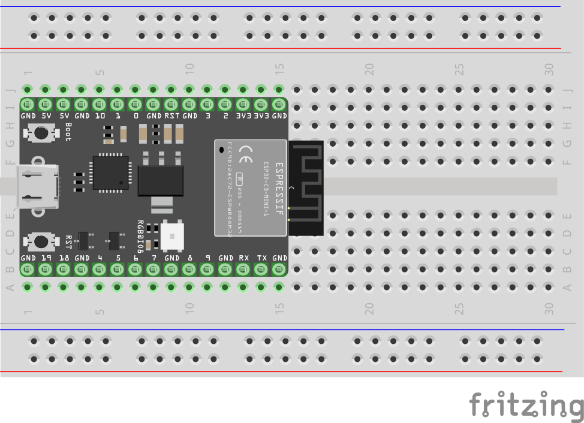

# Blinking External LEDs: Digital Output

## Schematic
No schmatic, this only uses your dev board!

## Hookup Diagram


## Required Libraries
* `neopixel.mpy`
* `adafruit_pixelbuf.mpy`

## Sample Code
```python
import neopixel
import board
import random
import time

np = neopixel.NeoPixel(board.IO8, 1, brightness=.2, auto_write=False)
while True:
    np[0] = (random.randint(0,255), random.randint(0,255), random.randint(0,255))
    np.show()
    time.sleep(5)
```
